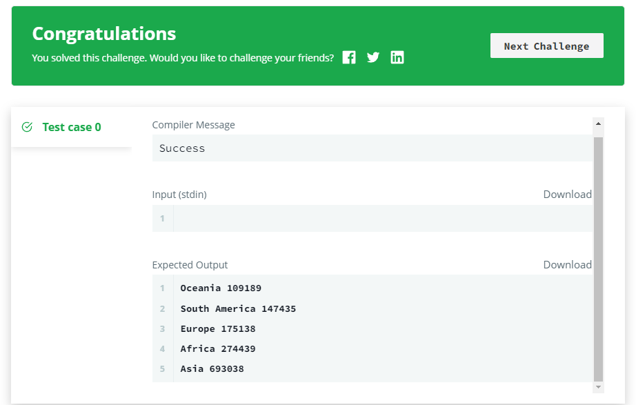

# Average Population of Each Continent

### [🏸문제](https://www.hackerrank.com/challenges/average-population-of-each-continent/problem) 

<hr>


### 💊풀이

> JOIN( INNER JOIN) 을 활용하자

1. INNER JOIN 을 사용하여 두 테이블에서 같은 키를 기준으로 함치자
1. 문제에서 원하는 값을 가져오자(join을 사용하였기에 같은 컬럼명을 가진 컬름을 table.column name 으로 정확히 찍어내기)

<hr>

### 📌코드

```mysql
SELECT CONTINENT, FLOOR(AVG(CITY.POPULATION))
FROM CITY
INNER JOIN COUNTRY
ON COUNTRY.CODE = CITY.COUNTRYCODE
GROUP BY CONTINENT;
```

<hr>


### 🛀결과



기초적인 함수들을 많이 사용하며 익힐 필요가 있다. 또한 join 후에는 select에서 컬럼을 찍어낼 때 어떤 테이블에서 가져온 컬럼인지를 명확하게 해주기 위해 table.column name 으로 사용해야된다는 것을 잊지 말자. 또한 쿼리가 복잡해질 수록, 데이터가 많아질 수록 직관적이고 효율적이게 짜기 위해 명시적으로 코드를 작성하도록 노력하자.
